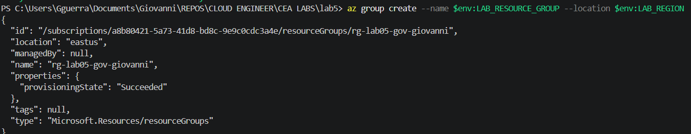
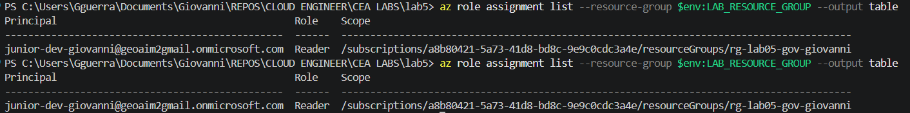
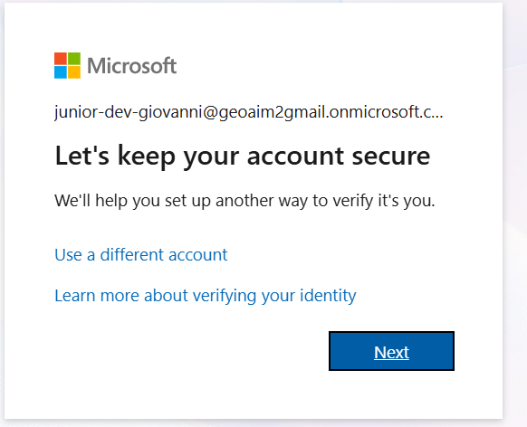
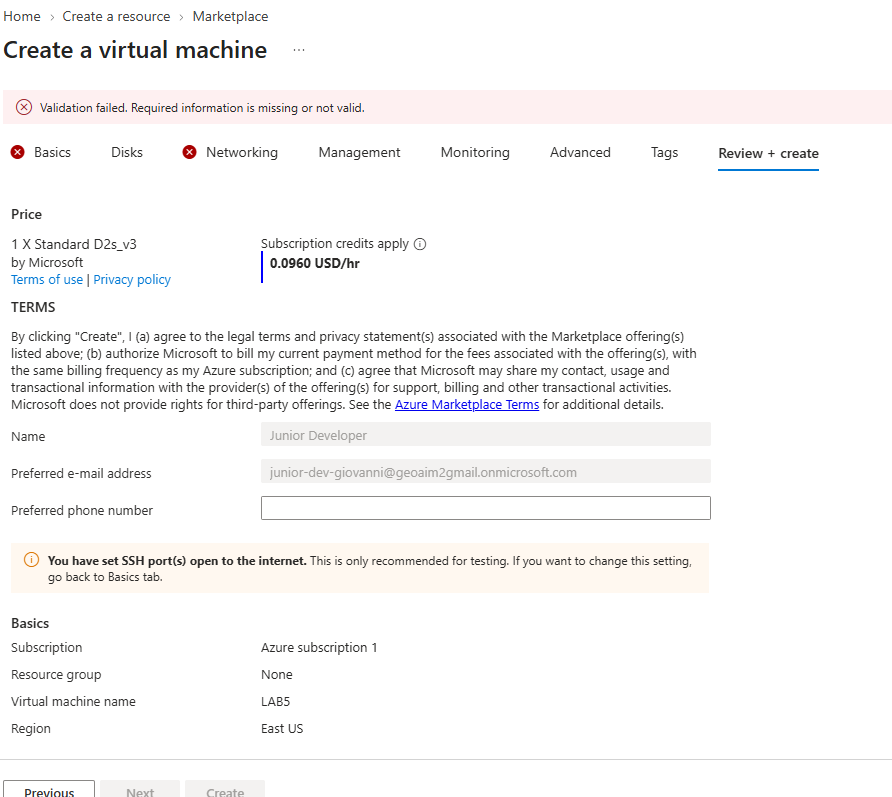
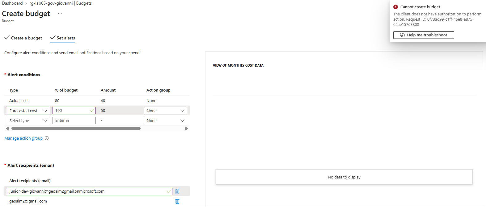
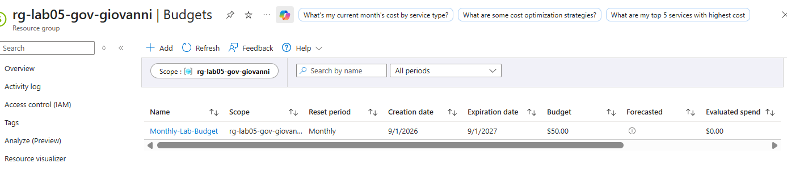
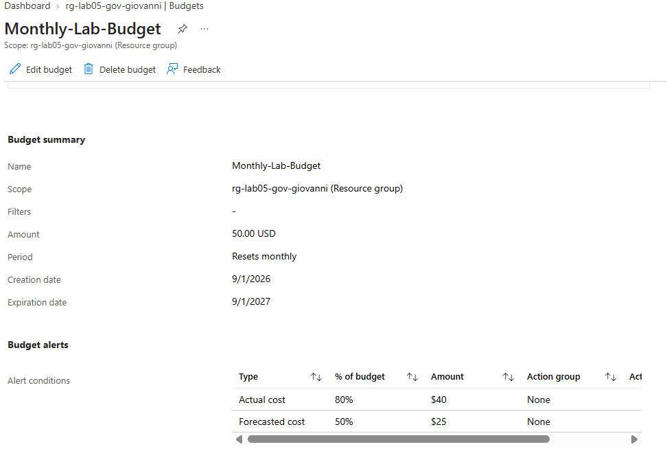
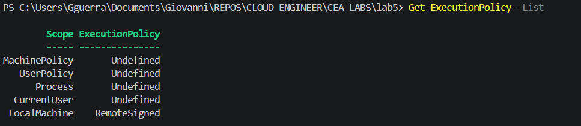
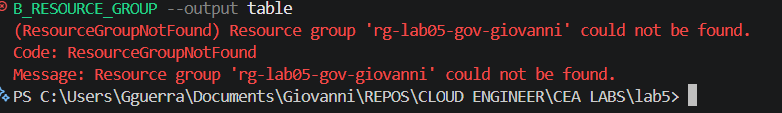

# Cloud Engineering Accelerator - Lab 05
# Implementing Governance and Security Hardening


# ** 🎬 Watch Me Build This Lab! [Watch the walkthrough on Loom](https://www.loom.com/share/82986818a5974db2938ba4112df5047e)**

---

## What This Lab Is

Cloud governance is the set of rules, roles, and guardrails that keep an Azure environment from turning into ten employees with a master key to the building. This lab builds three governance controls in one resource group: a Reader-only role assignment for a simulated junior developer, an Azure Policy that blocks expensive VM sizes for everyone including the Owner account, and a cost budget with both an actual and a forecasted alert threshold. Each control maps directly to a function in the NIST Cybersecurity Framework.

## What You Will Build


<details>
<summary>Text version of the diagram</summary>

```
Azure Subscription
 ├── Cloud Admin (Owner)
 │    ├── creates -> Microsoft Entra ID user (Junior Developer)
 │    ├── assigns Reader role -> scoped to rg-lab05-gov-[yourname]
 │    └── assigns Azure Policy -> Restrict-VM-Sizes (applies to Admin too)
 │
 ├── rg-lab05-gov-[yourname]
 │    ├── RBAC: Reader role -> Junior Developer (view only, zero write access)
 │    ├── Policy: Restrict-VM-Sizes (allows only B1s / B1ms, Deny effect)
 │    └── VM Deployment Test
 │          ├── Standard_B1s      -> ALLOWED
 │          └── Standard_D2s_v3   -> BLOCKED ("Validation failed - Policy check failed")
 │
 └── Cost Management
      └── Monthly-Lab-Budget ($50, resource group scope)
            ├── Actual alert     @ 80% ($40 spent)
            └── Forecasted alert @ 100% (projected to exceed $50)
```

</details>

## Skills You Will Practice

| Skill | Tool |
|---|---|
| Identity and user provisioning | Microsoft Entra ID |
| Role-based access control (least privilege) | Azure RBAC |
| Configuration guardrails (Deny effect) | Azure Policy |
| Cost visibility and alerting | Azure Cost Management + Budgets |
| Mapping technical controls to a compliance framework | NIST Cybersecurity Framework |

## Cost

Budget scoped to $50/month against the lab resource group; the lab itself only provisions a resource group, a policy assignment, and a budget, so actual spend during the build is close to $0 as long as no VM deployment is completed.

## Time

60-75 minutes.

## Prerequisites

- Active Azure subscription (`az account show` or confirm in portal.azure.com)
- Familiarity with Microsoft Entra ID, RBAC, and Azure Policy basics
- An incognito/private browser window available, to simulate the Junior Developer login without logging out of the Admin account
- 10-15 minutes of patience after the policy assignment for it to propagate

## Quick Start

**NOTE:** Swap the `<yourtenant>` and `<sub-id>` placeholders below for your real values before running (see the full SOP's "Before You Open VS Code" section for where to find them). On Windows, a literal `<...>` left in an `az` command breaks it with `The system cannot find the file specified`, since `cmd.exe` reads `<`/`>` as redirection even inside quotes.

```powershell
# 0. Go to your cloned repo folder, then sign in to Azure (device code, no browser popup)
cd "<path to your cloned repo folder>"
az login --use-device-code
az account show --output table

# 1. Load lab variables
. .\set-vars.ps1

# 2. Create the resource group
az group create --name $env:LAB_RESOURCE_GROUP --location $env:LAB_REGION

# 3. Create the junior developer user (password collected interactively)
$pw = Read-Host -AsSecureString "Set a password for the junior dev account"
az ad user create --display-name $env:LAB_JUNIOR_DISPLAY `
  --user-principal-name "$($env:LAB_JUNIOR_UPN_NAME)@<yourtenant>.onmicrosoft.com" `
  --password $pw --output none
Remove-Variable pw

# 4. Assign Reader, scoped to the resource group
az role assignment create --assignee "$($env:LAB_JUNIOR_UPN_NAME)@<yourtenant>.onmicrosoft.com" `
  --role "Reader" --scope "/subscriptions/$(az account show --query id -o tsv)/resourceGroups/$($env:LAB_RESOURCE_GROUP)" 

# 5. Assign the VM-size policy (Deny effect)
az policy assignment create --name $env:LAB_POLICY_NAME `
  --scope "/subscriptions/<sub-id>/resourceGroups/$($env:LAB_RESOURCE_GROUP)" `
  --policy "cccc23c7-8427-4f53-ad12-b6a63eb452b3" `
  --params "{\"listOfAllowedSKUs\":{\"value\":[\"Standard_B1s\",\"Standard_B1ms\"]}}"

# 6. Test the policy (wait 10-15 minutes after step 5 so the policy has time to turn on)
# What: ask Azure to check two VM requests without building either one. Why: this proves the rule
# blocks bad sizes and allows good ones, and --validate means no VM is created and nothing costs money.
# Blocked size: expect an error naming RequestDisallowedByPolicy and Restrict-VM-Sizes
az vm create --validate --resource-group $env:LAB_RESOURCE_GROUP --name vm-policy-test --image Ubuntu2204 --size Standard_D2s_v3 --admin-username azureuser --generate-ssh-keys
# Allowed size: expect no policy error (same request, only the size changed)
az vm create --validate --resource-group $env:LAB_RESOURCE_GROUP --name vm-policy-test --image Ubuntu2204 --size Standard_B1s --admin-username azureuser --generate-ssh-keys
```

Portal steps for every phase (including the budget, which is portal-only in this lab) are in the [full SOP](docs/CEA-Lab05-Implementing-Governance-and-Security-Hardening-SOP.md).

## Security Flags Applied

| Flag / Setting | Why |
|---|---|
| Reader role scoped to resource group (not subscription) | Limits the blast radius of the assignment to exactly one contained environment |
| Azure Policy effect: Deny | Blocks non-compliant deployments at validation time, before any resource is created or cost incurred |
| Policy applies to Owner account too | Governance that can be bypassed by elevating your own permissions is not governance |
| Budget: both Actual and Forecasted alert types | Actual gives ground truth after spend happens; Forecasted gives advance warning before the limit is hit |
| Deny-by-default identity model | The Junior Developer account starts with zero permissions until explicitly granted Reader |

## Verify It Works

```powershell
az role assignment list --resource-group $env:LAB_RESOURCE_GROUP --output table
az policy assignment list --output table
```

Expected: the Junior Developer listed with Reader at the resource-group scope, and `Restrict-VM-Sizes` listed as a Deny assignment scoped to the same group. In the portal, a VM creation attempt with `Standard_D2s_v3` returns a red "Validation failed" banner naming `Restrict-VM-Sizes`; the same attempt with `Standard_B1s` passes validation. The CLI test in Quick Start step 6 gives the same result: `Standard_D2s_v3` fails with `RequestDisallowedByPolicy`, and `Standard_B1s` passes.

## Screenshots

**Resource group and RBAC stood up clean.**



**MFA enforced on first sign-in for the Junior Developer account - Protect function in action.**


**Policy proof: the Deny effect actually blocks an out-of-policy VM size.**


**Budget creation failed while signed in as the Reader-only test account, then succeeded once switched to the Admin account, with both alert thresholds confirmed.**




**Troubleshooting proof: PowerShell execution policy diagnosis for the `set-vars.ps1` signing error.**


**Clean teardown confirmed - Recover function.**


## Project Structure

```
Lab-05-Implementing-Governance-and-Security-Hardening/
├── README.md                          This file
├── .gitignore                         Excludes credentials, keys, state files
├── set-vars.ps1                       Lab variable template, no secrets
├── assets/
│   ├── architecture.svg               Animated architecture diagram
│   ├── architecture.png               Static fallback
│   ├── screenshots/                   Build proof screenshots (01-09, numbered by phase)
│   └── thumbnails/
│       ├── banner.svg                 Repo hero image
│       ├── post1-loom.svg             LinkedIn Post 1 thumbnail
│       ├── post2-github.svg           LinkedIn Post 2 thumbnail
│       ├── post3-learned.svg          LinkedIn Post 3 thumbnail
│       ├── post4-different.svg        LinkedIn Post 4 thumbnail
│       ├── png/                       PNG exports of the above
│       └── generic/                   Low-text scroll-stopping alternates + PNGs
├── linkedin/
│   └── CEA-Lab05-LinkedIn-Posts.md    All four posts, thumbnails, hashtags
└── docs/
    └── CEA-Lab05-Implementing-Governance-and-Security-Hardening-SOP.md
```

## Clean Up

```powershell
az group delete --name $env:LAB_RESOURCE_GROUP --yes --no-wait
az ad user delete --id "$($env:LAB_JUNIOR_UPN_NAME)@<yourtenant>.onmicrosoft.com"
```

Deleting the resource group removes the policy assignment and budget scoped to it automatically. Nothing in this lab is a dependency for later labs, so a full teardown is safe.

## LinkedIn Post Series

| # | Post | Thumbnail | Generic alternate |
|---|---|---|---|
| 1 | [Loom video](LOOM_URL) | `assets/thumbnails/png/post1-loom.png` | `assets/thumbnails/generic/png/g1-watch.png` |
| 2 | GitHub repo | `assets/thumbnails/png/post2-github.png` | `assets/thumbnails/generic/png/g2-github.png` |
| 3 | One thing I learned | `assets/thumbnails/png/post3-learned.png` | `assets/thumbnails/generic/png/g3-learned.png` |
| 4 | What I'd do differently | `assets/thumbnails/png/post4-different.png` | `assets/thumbnails/generic/png/g4-different.png` |

Full post text: [linkedin/CEA-Lab05-LinkedIn-Posts.md](linkedin/CEA-Lab05-LinkedIn-Posts.md)

## Part of the CEA Series

| Lab | Topic | Repo |
|---|---|---|
| Lab 01 | Static Website on Azure Blob Storage | [Azure-Static-Website-Lab](https://github.com/Gguerra4networks/Azure-Static-Website-Lab) |
| Lab 02 | Secure 2-Tier Web App with Vulnerability Scanning | TBD |
| Lab 03 | Modernizing to PaaS & Securing Secrets | [Azure-PaaS-Key-Vault-Secrets-Lab](https://github.com/Gguerra4networks/Azure-PaaS-Key-Vault-Secrets-Lab) |
| Lab 04 | Infrastructure as Code with Terraform | TBD |
| **Lab 05** | **Implementing Governance and Security Hardening** | **This repo** |

## Reference: Cost Management Concepts

Kept from the original SOP for quick lookup.

| Cost Management concept | What it means in plain English |
|---|---|
| Budget | A spending limit you define for a scope (subscription, resource group, or management group) over a time period (usually a billing month). When actual or projected spend crosses a threshold, alerts fire. |
| Budget scope | The boundary the budget watches. In this lab the budget is scoped to the resource group. In a real environment you might have a budget for the entire subscription, separate budgets per team or project, and departmental budgets rolled up to a management group. |
| Reset period | How often the budget resets. Billing month means it resets on the first of each month, so you start fresh every month against the same limit. |
| Actual alert | Fires when money has already been spent and the cumulative total crosses the threshold. Example: 80% actual means you have already spent $40 of your $50 budget this month. |
| Forecasted alert | Fires when Azure projects that you will exceed the budget by the end of the period, based on your current spending rate. Example: you are on day 10 of the month and already at $35. Azure projects you will spend $105 by month end and fires a 100% forecasted alert early. |
| Action Group | An optional but powerful addition. Instead of just emailing you, an action group can send an SMS, trigger a webhook, call a Logic App, or run an Azure Function that automatically shuts down non-critical resources. This lab uses email only. |
| Cost Analysis | A separate view that breaks down spend by resource type, resource group, tag, or time period. This is how you investigate after an alert fires: you go to Cost Analysis to find what is driving the spend. Out of scope for this lab, but a critical tool to know exists. |

**Why this matters from a NIST perspective:** cost anomalies are security signals. If your Azure spend triples in one day and you did not deploy anything new, that is a Detect event. It could be a misconfigured auto-scaling group, a runaway job, or a compromised account spinning up resources. Budget alerts give you the earliest possible warning.

## Reference: Lab Variables and Naming Convention

Replace `[yourname]` with your actual first name, lowercase, no spaces. Use these names exactly throughout the lab so your resources match the instructions.

| Variable | Value to use |
|---|---|
| Resource Group | `rg-lab05-gov-[yourname]` |
| Test User principal name | `junior-dev-[yourname]@[yourtenant].onmicrosoft.com` |
| Test User display name | `Junior Developer` |
| Policy Assignment Name | `Restrict-VM-Sizes` |
| Budget Name | `Monthly-Lab-Budget` |
| Budget Amount | `$50` |

## Author

Giovanni Guerra - Field Engineer pivoting into cloud security and federal IT.
[GitHub: Gguerra4networks](https://github.com/Gguerra4networks) - [LinkedIn](https://linkedin.com/in/giovanni-giovanni)
